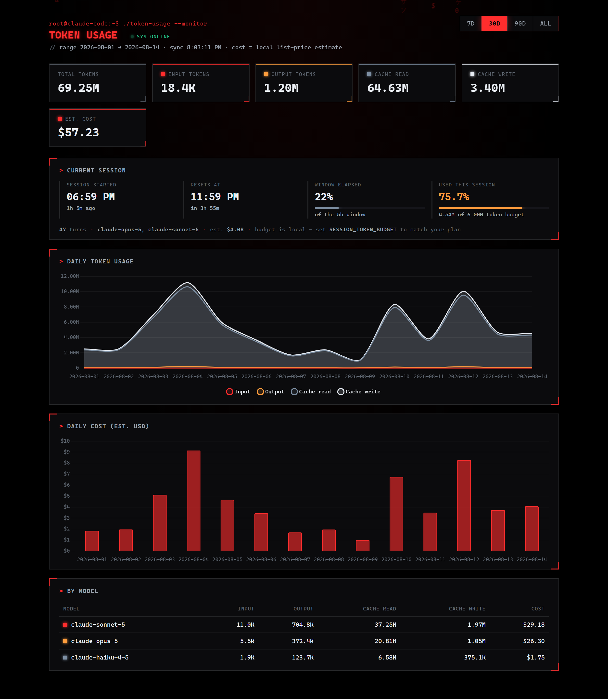
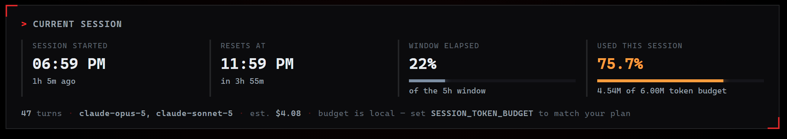

# Token-Usage

A self-hosted dashboard for Claude Code token usage. It reads Claude Code's own
local session transcripts — **no API key of any kind is required**, and nothing
leaves your machine.



<sub>Screenshots use generated sample data, not real usage.</sub>

## What it shows

- **Current session** — when the rolling usage window started, when it resets,
  how much of the window has elapsed, and what percentage of your token budget
  you've spent.
- **Daily token usage** — stacked input / output / cache-read / cache-write.
- **Daily cost** — estimated, see the caveat below.
- **By model** — per-model totals for the selected range (7d / 30d / 90d / all).



The session window is anchored to your first message and rolls forward in fixed
spans, so "resets at" is the point where the next message opens a new window.

## How it works

Claude Code writes one JSONL transcript per session to
`~/.claude/projects/<project>/<session-id>.jsonl`. Every assistant turn carries a
`message.usage` block with the token counts. The app globs those files, sums the
usage, and skips the zero-usage `<synthetic>` entries Claude Code emits for
interrupted turns.

The container reads that folder through a **read-only bind mount** — it never
writes to it.

## Running it

```bash
docker build -t token-usage-app .

docker run -d --name Token-Usage -p 5000:5000 \
  -v "$HOME/.claude/projects:/claude-logs:ro" \
  token-usage-app
```

On Windows the mount path is `-v "C:\Users\<you>\.claude\projects:/claude-logs:ro"`.

Then open <http://localhost:5000>.

## Configuration

All optional, set with `-e NAME=value` on `docker run`:

| Variable | Default | Purpose |
| --- | --- | --- |
| `CLAUDE_LOGS_DIR` | `/claude-logs` | Where the transcripts are mounted. |
| `SESSION_WINDOW_HOURS` | `5` | Length of the rolling usage window. |
| `SESSION_TOKEN_BUDGET` | `100000000` | Denominator for the "used this session" percentage. |

## Caveats

- **Cost is a local estimate, not a bill.** There is no billing API involved.
  Costs are computed from a hardcoded list-price table (`PRICING` in `app.py`)
  and the standard cache multipliers — 0.1x input for cache reads, 1.25x for 5m
  cache writes, 2.0x for 1h. Discounts, subscription plans, and batch pricing are
  not reflected. Update `PRICING` when rates change.
- **Session budget is self-set.** Nothing in the local logs records your actual
  plan allowance, so `SESSION_TOKEN_BUDGET` is a number you choose.
- **Claude Code usage only.** Anything you send to the API outside Claude Code
  has no local transcript and so does not appear here.
